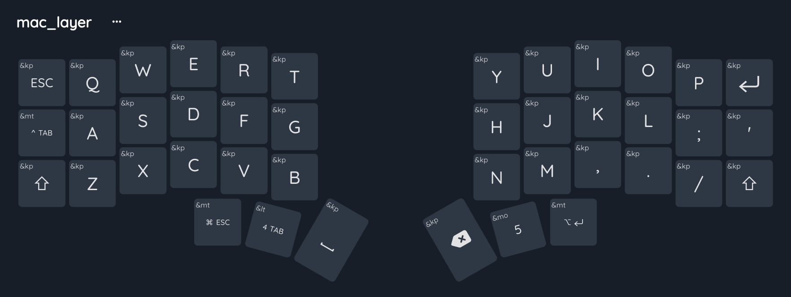
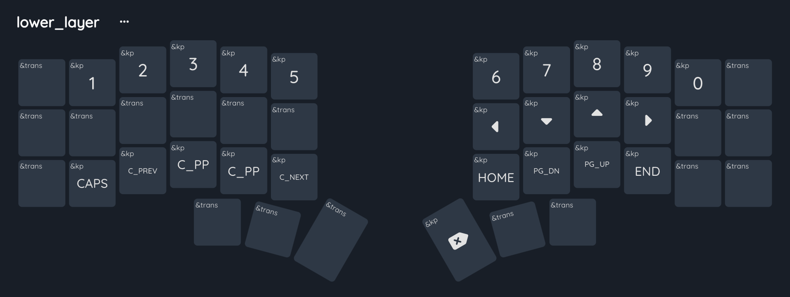

<h1 align="left">ZMK Config</h1>

  
  
  
  
  

> Personal ZMK firmware config

<!-- 
 -->
   <!-- <a href="#goals">Chippy</a>&nbsp;&nbsp;&nbsp;|&nbsp;&nbsp;&nbsp; -->
   <!-- <a href="#features">Features</a>&nbsp;&nbsp;&nbsp;|&nbsp;&nbsp;&nbsp; -->
   <!-- <a href="#technologies">Technologies</a>&nbsp;&nbsp;&nbsp;|&nbsp;&nbsp;&nbsp; -->
   <!-- <a href="#getting-started">Getting Started</a>&nbsp;&nbsp;&nbsp;|&nbsp;&nbsp;&nbsp; -->
   <!-- <a href="#contributing">Contributing</a>&nbsp;&nbsp;&nbsp;|&nbsp;&nbsp;&nbsp; -->
   <!-- <a href="#license">License</a> -->
<!-- 
 -->

## Chippy - Choc Spaced Corne XIAO

- Keeping it as close to traditional qwerty, but with a symbol layer that is more optimized for coding.
- Optimized for mac for now
- Heavily inspired on: https://github.com/FilipeJrd/zmk-config-corne-xiao-choc
- [keymap editor](https://nickcoutsos.github.io/keymap-editor/) to config ZMK layer

> 🚧 Layout still under development/optimization

   
   
   
   

## License

This project is under the [MIT license](https://github.com/danieljpgo/iachef/blob/master/LICENSE).

Released in 2023.

Make with by [Daniel Jorge](https://github.com/danieljpgo)
